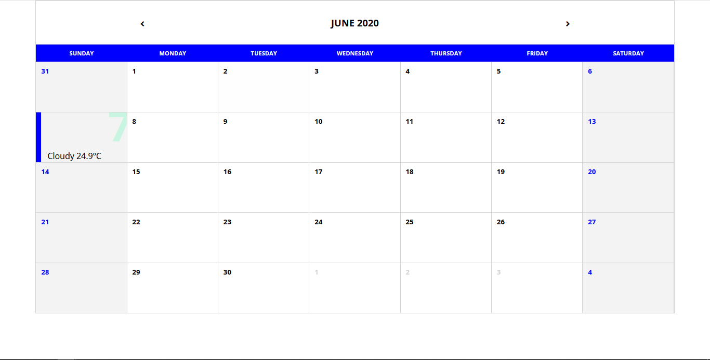
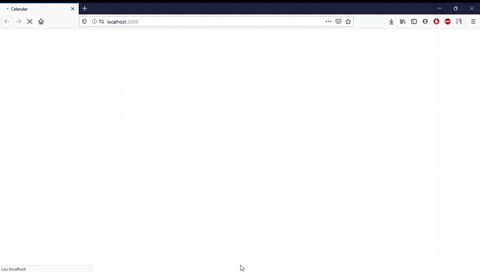

# 📆Calendar
This project is a simple calendar, created with ReactJS

# 📝Example
<h1>

</h1>

# 💻Usage
<h1>

</h1>
<p>You can browse the months of any year, select days and it will show you the weather. Temperature is only in Celsius for now.
</p>

# 🛠 Technologies
The project was developed with these technologies:

- [ReactJS](https://reactjs.org)
- [Axios](https://github.com/axios/axios)
- [OpenWeather API](https://openweathermap.org/api)
- [Date-FNS](https://date-fns.org/)

# ⚙ Installing

```bash
    #Clone repo
    $ git clone https://github.com/JoaoptGaino/Calendar

    #Enter repo directory
    $ cd Calendar

    #Install the dependencies
    $ npm install

    #Init project
    $ npm start

```


# ✍Authors
- **João Pedro Theodoro Gaino**:
    - [GitHub](https://github.com/JoaoptGaino)
    - [Linkedin](https://www.linkedin.com/in/jo%C3%A3o-pedro-theodoro-gaino-b447a6178/)
    


